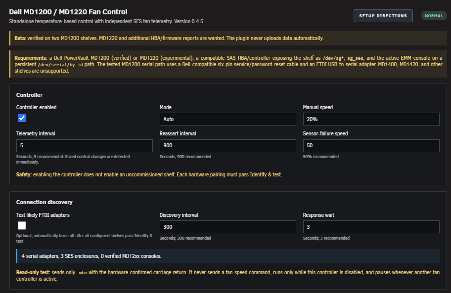
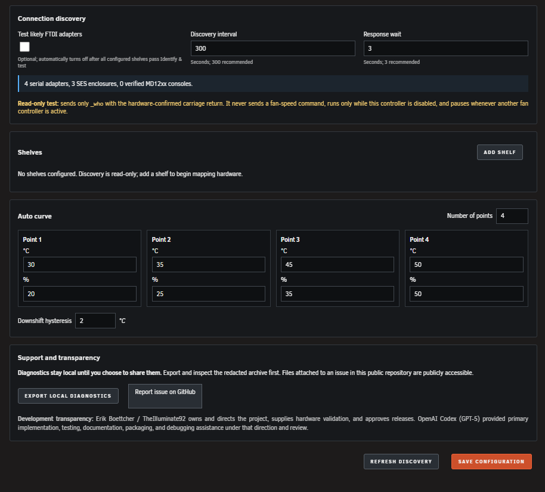

# MD12xx Fan Control for Unraid

Standalone, host-native fan control for Dell PowerVault MD1200 and MD1220 disk shelves.

> **Beta:** MD1200 control and SES telemetry have been verified on real hardware. MD1220 uses the same Dell MD12xx enclosure family and is included for testing, but its serial fan response still requires independent hardware confirmation.

## Hardware status

| Shelf | Current confidence |
| --- | --- |
| Dell PowerVault MD1200 | Two independent shelves passed serial identity, automatic SES/disk mapping, 20% → 50% response, and telemetry-proven 20% restoration on Unraid 7.3.2. |
| Dell PowerVault MD1220 | Control path and 24-bay topology are covered by synthetic tests; real serial and RPM hardware validation is still requested. |

Reports from different HBAs, firmware revisions, serial adapters, and Unraid releases are wanted. Use the repository's **Beta hardware report** issue form and remove unique identifiers before posting.

## Requirements

- Unraid 7.3.2 or newer. This is the oldest release validated by the current beta.
- A Dell PowerVault MD1200, or an MD1220 for experimental validation. MD1400, MD1420, and other shelves are not supported by this release.
- A compatible SAS HBA/controller and external SAS cabling that expose both the enclosure's disks and a SCSI Enclosure Services device under `/dev/sg*` to Unraid.
- `sg_ses` available on the Unraid host.
- Access to the active/primary EMM console through a persistent `/dev/serial/by-id` path. The tested MD1200 command path uses a Dell-compatible six-pin service/password-reset cable, an FTDI USB-to-serial adapter, and the required USB cable to the server. Other adapter chipsets are unverified.
- Matching firmware on both EMMs is strongly recommended.
- Exclusive fan control: Docker containers, scripts, and other plugins that write to the same serial console must be stopped.

The plugin discovers candidates and prefers to prove each serial-to-SES pairing with a guarded RPM test. When SES fan readings do not respond, it can pair a serial EMM's ELI address to an identical SES enclosure logical identifier. It does not assume that a USB adapter, model string, disk count, or path belongs to a particular shelf.

The command and verification paths are intentionally independent:

```text
Fan commands: Unraid USB -> FTDI adapter -> Dell service cable -> active EMM console
Verification: Unraid -> SAS HBA/controller -> enclosure SES interface
```

The plugin reads SES enclosure status through the HBA; it does not configure or flash the HBA, change RAID settings, or send fan commands through SAS. Disk temperatures and spin state come from Unraid's existing `/var/local/emhttp/disks.ini` state rather than direct SMART polling by this plugin.

MD1200 hardware validation currently covers the tested direct-attached arrangements described in the hardware reports. Split mode, daisy chains, redundant paths, alternate EMM layouts, and MD1220 hardware remain Beta test cases unless a report explicitly proves them.

## Features

- Supports one or more MD1200/MD1220 shelves.
- Passively inventories candidate SES devices, persistent serial adapter paths, and Unraid disks.
- Automatically maps the shelf's current Unraid disk names through standard enclosure links or the verified SES device's exact SAS expander.
- Optionally verifies likely FTDI serial consoles with a read-only `_who` query while all fan controllers are stopped.
- Offers a guarded 15-second physical 50% ramp and explicit operator-confirmed SES pairing for shelves whose SES RPM does not respond to fan commands.
- Uses the EMM `sas_address` ELI and the SES configuration-page enclosure identifier as an exact identity fallback when RPM proof fails; those shelves are marked as lacking live RPM response verification.
- Auto mode controls each shelf from its assigned disks independently.
- Manual choices from 20% through 100% in 10% increments.
- Reads independent fan RPM telemetry through `sg_ses`.
- Saves each shelf's commissioned 20%/50% RPM response and verifies later control commands against independent SES telemetry.
- Uses stable SCSI addresses and `/dev/serial/by-id` paths.
- Uses carriage-return-only BlueDress `set_speed` command framing confirmed on MD1200 hardware.
- Blocks writes while the legacy `MD1200-Fan-Controller` Docker is running.
- Starts disabled and requires explicit configuration and commissioning.
- Retains settings during normal plugin updates. Uninstall deliberately removes configuration and commissioning results so reinstall starts clean.
- Supervises the controller process, restarts unexpected exits with bounded backoff, and sends local Unraid failure and recovery notifications.

## Default Auto curve

| Hottest assigned disk | Fan target |
| --- | ---: |
| All assigned disks spun down | 20% |
| Below 35°C | 20% |
| 35–44.9°C | 25% |
| 45–49.9°C | 30% |
| 50°C or hotter | 50% |
| Active disk without valid temperature | 50% fail-safe |

The controller polls every 5 seconds, uses 1°C downshift hysteresis, and reasserts the target every 15 minutes. Saved control changes wake the controller immediately rather than waiting for the next telemetry poll. After a command, the controller waits for independent SES telemetry to match the commissioned response; failure becomes a visible fault and triggers a guarded retry. Continued telemetry drift is also detected. Commands above 50% can prove at least the commissioned 50% response, but their exact RPM remains uncalibrated.

The Settings page supports between 2 and 10 Auto-curve points. Temperatures must increase, and fan speeds may stay level or increase as temperature rises.

## Safety model

The normal setup asks for one verified persistent serial adapter. The guarded identification test repeats the read-only MD12xx console check, obtains its ELI SAS identity, records a 30-second 20% baseline, then samples candidate SES enclosures every five seconds at 50%. It prefers a unique stable RPM response and independent proof of return to 20%. If SES RPM remains static or otherwise cannot prove the response, one exact ELI-to-SES configuration-page identity match can commission with reduced fan-response verification after an acknowledged 20% → 50% → 20% command sequence. The full RPM sample history is included in the downloadable test results. Disk mapping uses standard enclosure-slot links when available and otherwise requires the disks to share the matched SES device's exact SAS expander. If neither relationship is available, the Settings page retains an explicit Manual mapping fallback.

The plugin does not treat a matching model name, USB vendor, prompt string, or drive count as proof of a serial-to-SES pairing. Ambiguous RPM results require one unique, exact EMM/SES SAS identity match or explicit physical confirmation; empty or conflicting disk assignments are not commissioned. A SAS-matched shelf still requires acknowledged 20% → 50% → 20% serial commands, but the plugin cannot claim live SES RPM proof of fan response or drift. If the commissioned disk mapping changes or assigned disks disappear from Unraid's inventory, Auto mode selects the configured fail-safe speed instead of assuming the disks are asleep. Changing a shelf's model, serial adapter, SES pairing, assignment mode, or disk list clears commissioning and requires a new test.

For firmware that reports static SES fan RPM, disable all fan controllers and use **Ramp this adapter to 50%**. Watch which physical shelf responds, name it, select the SES enclosure using its discovered Unraid disks, and select **Confirm physical pairing** within 10 minutes. This path commissions only after an explicit physical confirmation and a verified SES-to-disk mapping. The controller still requires a serial command acknowledgement and uses assigned disk temperatures and fail-safe behavior, but cannot verify physical fan response or detect fan-speed drift through SES. The UI and controller status show this reduced verification. Incorrect operator pairing can cool the wrong disks; check the mapped disks and physical shelf carefully before enabling control.

If commissioning cannot prove the final 20% state by SES RPM, a unique SAS identity match may use the acknowledged 20% restoration with a visible reduced-verification warning. Without either proof path, the shelf remains uncommissioned. Keep competing fan writers stopped and use **Identify & test** again; each retry begins by commanding 20%. If restoration cannot be acknowledged, stop setup and restore a known-safe state using the enclosure's previously proven control method.

Active connection discovery is off by default and automatically turns off once every configured shelf has passed commissioning. It can be enabled again manually for troubleshooting. When enabled, it considers a console verified only when the structured MD12xx `_who` response and the primary/active EMM role are both present. `BlueDress` is recorded when seen but is not required, because prompt wording may differ by firmware. Discovery never sends `set_speed` and pauses whenever this or another fan controller is active.

Do not run this plugin alongside another process that writes to the same enclosure serial adapter.
The controller, discovery worker, and commissioning test also refuse to open a serial device that the operating system reports as already in use.

## Install and setup

Download the published plugin manifest and install it through **Plugins → Install Plugin**, or use:

```bash
wget -O /tmp/md12xx.fancontrol.plg \
  'https://raw.githubusercontent.com/TheIlluminate92/unraid-md12xx-fan-control/main/releases/md12xx.fancontrol.plg'
plugin install /tmp/md12xx.fancontrol.plg
```

The WebGUI installer requires a current authenticated Unraid session and a valid CSRF token. If **Install** only clears the URL and the system log records no plugin-manager attempt, reconnect through the server's direct local WebGUI and sign in again; remote or proxied sessions that do not expose the Unraid token cannot submit the native installer form. This failure occurs before the plugin URL is downloaded.

Open **Settings → Utilities → MD12xx Fan Control**, expand **Setup directions**, and leave the controller disabled until every shelf passes **Identify & test**. The app shows live progress for the guarded 20% → 50% → 20% test and continues the server-side safety workflow if the page is closed. **Refresh discovery** saves only the discovery options and runs one guarded inventory pass immediately. Active FTDI testing is a temporary setup tool and turns off after every configured shelf is commissioned.

If discovery identifies the selected console but reports that it is not the active/primary EMM, move the service connection to the active EMM and refresh discovery before commissioning. Do not bypass that identity check.

## Screenshots





Normal updates keep configuration. Uninstall is a complete reset: it removes `/boot/config/plugins/md12xx.fancontrol`, including saved shelf mappings, local diagnostics, and commissioning results, as well as runtime files and state. Copy anything you want to retain before uninstalling.

## Development

Build `dist/md12xx.fancontrol.plg`, copy it to the Unraid boot flash, then install it through **Plugins → Install Plugin**. Configure it under **Settings → Utilities → MD12xx Fan Control**.

Run `bash tests/verify.sh` on Linux before publishing. The suite builds the package, validates runtime syntax, exercises MD1200 and synthetic 24-bay MD1220 fixtures, checks the safety markers, and runs the local-only security policy scan.

## Privacy and diagnostics

**Export local diagnostics** creates and downloads a redacted archive from `/boot/config/plugins/md12xx.fancontrol/diagnostics`. It does not upload anything. Review the archive before sharing it, then use **Report issue on GitHub** to open the public issue form and attach the archive yourself. Files attached to this public repository can be accessed without authentication. See [SECURITY.md](SECURITY.md) for the exact read/write and network boundaries.

The plugin intentionally does not authenticate to GitHub or upload diagnostics automatically. That keeps repository credentials off the server and leaves the final privacy decision with the operator.

The optional terminal-only `interrogate-emm.sh` script captures `_who`, `_ver`, and the console's command listing from explicitly supplied persistent serial adapters, plus read-only SES status and SCSI inquiry pages from connected enclosures. It requires the controller and competing fan writers to be stopped, never executes discovered commands, and saves an archive locally for review. The command listing can include dangerous commands; it is data, not an execution plan.

After updating the plugin and disabling all fan controllers, list the adapters with `ls -l /dev/serial/by-id/`, then run:

```bash
/usr/local/emhttp/plugins/md12xx.fancontrol/scripts/interrogate-emm.sh \
  /dev/serial/by-id/ADAPTER_ONE /dev/serial/by-id/ADAPTER_TWO
```

Replace both placeholders with the actual persistent adapter paths. Review the archive path printed by the script before attaching it to a public report; it contains unredacted console identity and adapter paths.

## Development transparency

This is an AI-assisted open-source project. Erik Boettcher / TheIlluminate92 owns the project and provides product direction, the original Docker prototype, hardware access, safety decisions, physical testing, and release approval. OpenAI Codex (GPT-5) provided primary implementation assistance for the standalone plugin, including architecture, code generation, tests, documentation, packaging, and debugging, under Erik's direction and review. See [ACKNOWLEDGEMENTS.md](ACKNOWLEDGEMENTS.md) for the complete credits.

## Status integration

Other local plugins can read:

```text
/plugins/md12xx.fancontrol/include/api.php
```

The default GET response is intentionally read-only JSON containing controller and shelf state.

An optional compact dashboard module may be added after the standalone plugin has broader MD1220 validation.

## License and hardware disclaimer

MIT licensed. Dell does not document the BlueDress fan command used by this project. Use at your own risk, keep current backups, and validate every shelf before enabling automatic control.

See [ACKNOWLEDGEMENTS.md](ACKNOWLEDGEMENTS.md) for project credits, [CONTRIBUTING.md](CONTRIBUTING.md) for safe hardware reports and development rules, and [RELEASE_CHECKLIST.md](RELEASE_CHECKLIST.md) for the remaining Beta/Community Apps gates.
